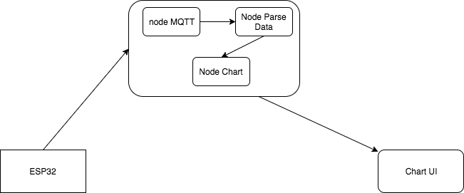
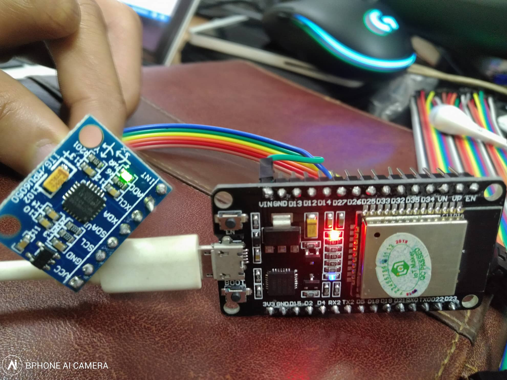
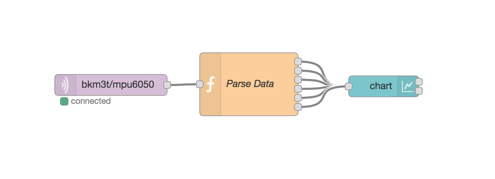

# Câu 2

## Giải pháp

Firmware: Mỗi giây đọc dữ liệu từ cảm biến mpu6050 sau đó gửi lên topic `bkm3t/mpu6050` theo định dạng 

```
{'yaw': -157.7411, 'pitch': -4.701654, 'roll': -1.870299, 'Ax': -53, 'Ay': 630, 'Az': 7189, 'timestamps': 1542884104.3893933}
```

Node-red: Sử dụng node mqtt để lắng nghe data được module esp32 gửi lên qua topic `bkm3t/mpu6050` sau đó sử dụng node function để tiến hành parse data nhận được sau đó gửi tới node chart để vẽ đồ thị theo thời gian thực.

Docker: Đóng gói node-red,MQTT broker vào docker-compose.

## Thiết kế kiến trúc hệ thống



Mạch esp32:



## Cấu trúc node-red



- Node bkm3t subcrible topic chứa data gửi lên từ esp32
- Node Parse tiến hành parse data
- Node Chart nhận data để vẽ đồ thị
- Node Time get time
- Node Template: hiển thị thời gian từ lúc bắt đầu thu thập dữ liệu.

## Hướng dẫn deploy

cd  Cau2/Product

docker-compose up